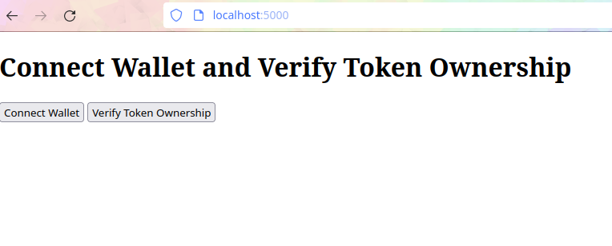
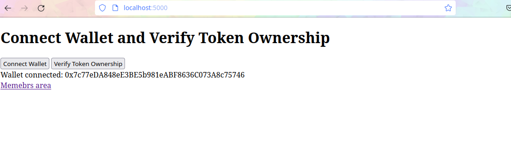
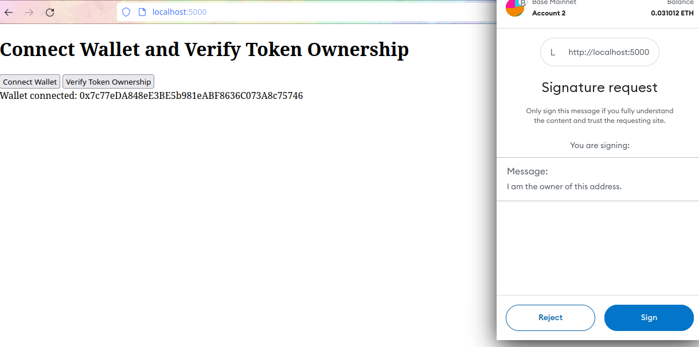
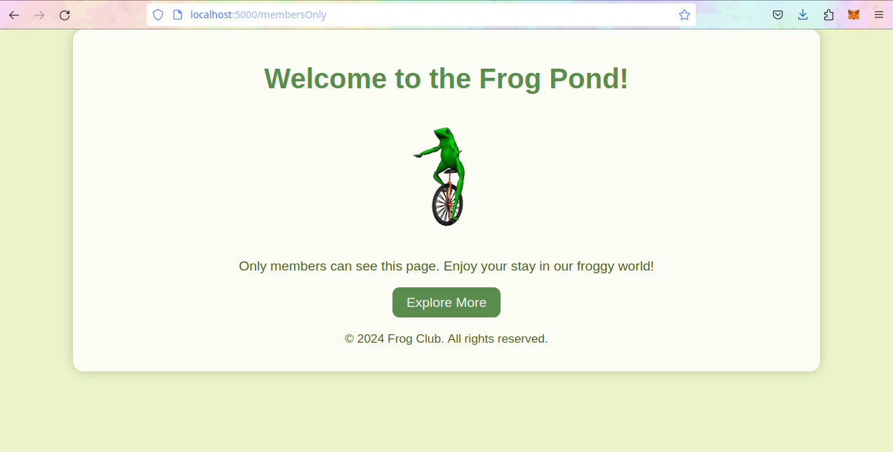
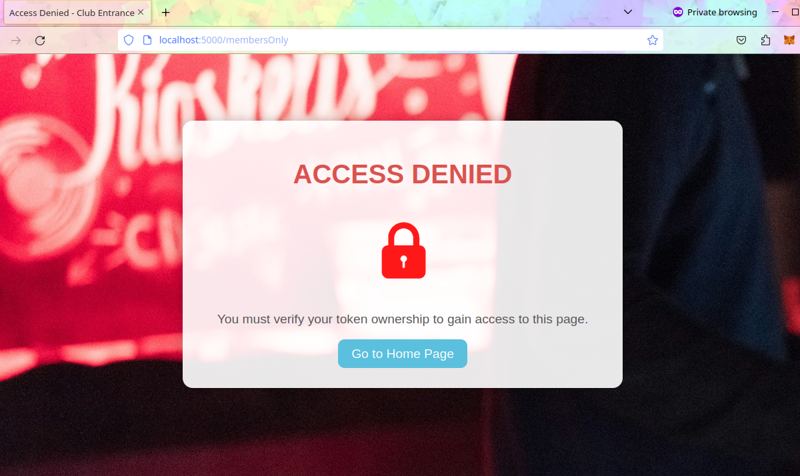

# TokenGateService-Lite
TokenGateService is a flask application for creating token gated applications. Can be used as a standalone system or as a middle-ware. 

## Usage

### Webpage 
Currently the index page exposes a page that allows a user to connect wallet and to verify ownership of a token by singing a message. 

### API 

The api endpoint is /verify-token. Sending a message and signature will return a valid cookie as part of the header. 

### Client Libraries 

There are php and python example client libraries that connect to an instance of token gated service. 

## Warning 

Note this is currently a proof of concept. The nonce is not very random and there is no chain id in the signature. 
Currently it is using a simple nonce and personal sign method in web3.js but needs to be upgraded to using eip-712 message by creating the strucutred data and singing with signTypedData()

### Main page 

### Connected Wallet 

### Signature Request 

### Fail 

### Content unlocked 

### Content Locked 

